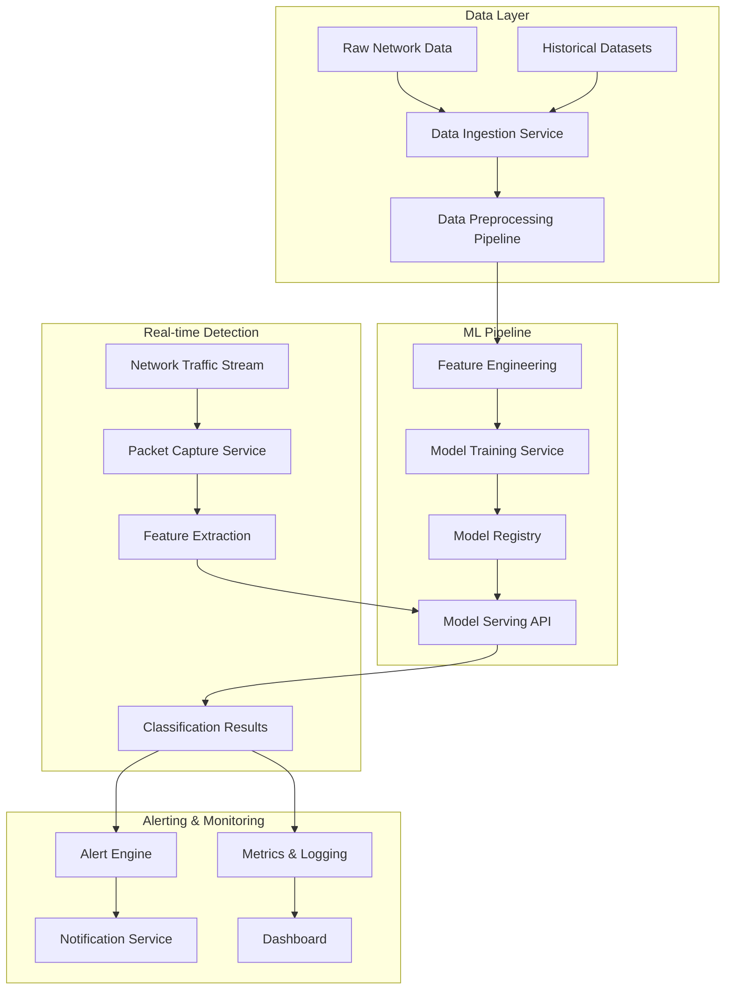

# Network Intrusion Detection System Design

## Overview

The Network Intrusion Detection System (NIDS) is designed as a modular, scalable machine learning pipeline that processes network traffic data to detect and classify security threats in real-time. The system follows a microservices architecture with clear separation between data processing, model training, inference, and alerting components.

The system supports both batch processing for model training and real-time streaming for live threat detection. It's built to handle multiple datasets (NSL-KDD, CICIDS2017/2018, UNSW-NB15) and can automatically adapt to different feature schemas.

## Architecture



## Components and Interfaces

### 1. Data Ingestion Service
**Purpose:** Handles loading and initial validation of network datasets
**Key Classes:**
- `DatasetLoader`: Abstract base class for dataset loading
- `NSLKDDLoader`: Specific loader for NSL-KDD dataset
- `CICIDSLoader`: Loader for CICIDS2017/2018 datasets
- `DataValidator`: Validates data integrity and schema

**Interfaces:**
```python
class DatasetLoader:
    def load_data(self, file_path: str) -> pd.DataFrame
    def validate_schema(self, data: pd.DataFrame) -> bool
    def get_feature_names(self) -> List[str]
```

### 2. Data Preprocessing Pipeline
**Purpose:** Transforms raw network data into ML-ready features
**Key Classes:**
- `FeatureEncoder`: Handles categorical encoding
- `FeatureScaler`: Normalizes numerical features
- `FeatureCleaner`: Removes duplicates and irrelevant features
- `ClassBalancer`: Applies SMOTE or other balancing techniques

**Interfaces:**
```python
class PreprocessingPipeline:
    def fit_transform(self, X: pd.DataFrame, y: pd.Series) -> Tuple[np.ndarray, np.ndarray]
    def transform(self, X: pd.DataFrame) -> np.ndarray
    def save_pipeline(self, path: str) -> None
```

### 3. Model Training Service
**Purpose:** Trains and evaluates multiple ML models
**Key Classes:**
- `ModelTrainer`: Orchestrates training of multiple models
- `ModelEvaluator`: Computes performance metrics
- `HyperparameterTuner`: Optimizes model parameters
- `ModelComparator`: Selects best performing model

**Supported Models:**
- Random Forest Classifier
- XGBoost Classifier
- Support Vector Machine
- Neural Network (Multi-layer Perceptron)
- Deep Learning models (CNN/LSTM for sequential data)

### 4. Model Registry
**Purpose:** Manages model versions and metadata
**Key Classes:**
- `ModelRegistry`: Stores and retrieves trained models
- `ModelMetadata`: Tracks model performance and training info
- `ModelVersioning`: Handles model versioning and rollback

### 5. Real-time Inference API
**Purpose:** Provides real-time classification of network traffic
**Key Classes:**
- `InferenceService`: Main API service for predictions
- `ModelLoader`: Loads trained models for inference
- `FeatureExtractor`: Extracts features from raw network packets
- `PredictionCache`: Caches recent predictions for performance

**API Endpoints:**
- `POST /predict`: Single packet classification
- `POST /predict/batch`: Batch classification
- `GET /model/info`: Current model information
- `GET /health`: Health check endpoint

### 6. Packet Capture Service
**Purpose:** Captures and processes live network traffic
**Key Classes:**
- `PacketCapture`: Interfaces with Scapy for packet capture
- `TrafficParser`: Extracts relevant features from packets
- `StreamProcessor`: Handles continuous traffic streams

### 7. Alert Engine
**Purpose:** Generates and manages security alerts
**Key Classes:**
- `AlertManager`: Manages alert rules and thresholds
- `ThreatClassifier`: Categorizes threats by severity
- `AlertDeduplicator`: Prevents alert spam
- `NotificationDispatcher`: Sends alerts via multiple channels

## Data Models

### Network Traffic Record
```python
@dataclass
class NetworkTrafficRecord:
    timestamp: datetime
    source_ip: str
    destination_ip: str
    source_port: int
    destination_port: int
    protocol: str
    packet_size: int
    duration: float
    flags: List[str]
    features: Dict[str, float]  # Extracted statistical features
    label: Optional[str] = None  # For training data
```

### Prediction Result
```python
@dataclass
class PredictionResult:
    record_id: str
    timestamp: datetime
    is_malicious: bool
    attack_type: Optional[str]
    confidence_score: float
    feature_importance: Dict[str, float]
    model_version: str
```

### Alert
```python
@dataclass
class SecurityAlert:
    alert_id: str
    timestamp: datetime
    severity: str  # LOW, MEDIUM, HIGH, CRITICAL
    attack_type: str
    source_ip: str
    destination_ip: str
    confidence_score: float
    description: str
    recommended_action: str
```

## Error Handling

### Data Processing Errors
- **Invalid Data Format:** Log error, skip malformed records, continue processing
- **Missing Features:** Apply imputation strategies or use default values
- **Schema Mismatch:** Attempt automatic schema mapping, fallback to manual configuration

### Model Errors
- **Model Loading Failure:** Fallback to previous model version, alert administrators
- **Prediction Timeout:** Return cached result if available, otherwise return "unknown" classification
- **Memory Issues:** Implement batch processing with smaller chunks

### Network Errors
- **Packet Capture Failure:** Retry with exponential backoff, switch to backup interface
- **API Unavailability:** Queue requests for later processing, return cached responses
- **Database Connection Loss:** Use local caching, attempt reconnection

### Alert System Errors
- **Notification Failure:** Retry with different channels, log failed alerts
- **Alert Storm:** Implement rate limiting and alert aggregation
- **False Positive Handling:** Provide feedback mechanism for model improvement

## Testing Strategy

### Unit Testing
- Test each component in isolation
- Mock external dependencies (databases, APIs, network interfaces)
- Achieve >90% code coverage
- Test edge cases and error conditions

### Integration Testing
- Test end-to-end data flow from ingestion to prediction
- Validate API contracts between services
- Test with real network datasets
- Performance testing under load

### Model Testing
- Cross-validation on training datasets
- Test model performance on holdout test sets
- Adversarial testing with crafted attack patterns
- A/B testing for model comparisons

### Security Testing
- Test system resilience against actual attack patterns
- Validate that the system doesn't introduce new vulnerabilities
- Test alert system with simulated attacks
- Performance testing under attack conditions

### Performance Testing
- Latency testing for real-time predictions (<100ms requirement)
- Throughput testing for high-volume traffic
- Memory usage optimization
- Scalability testing with increasing data volumes

### Deployment Testing
- Docker container testing
- Health check endpoint validation
- Configuration management testing
- Rollback procedure testing